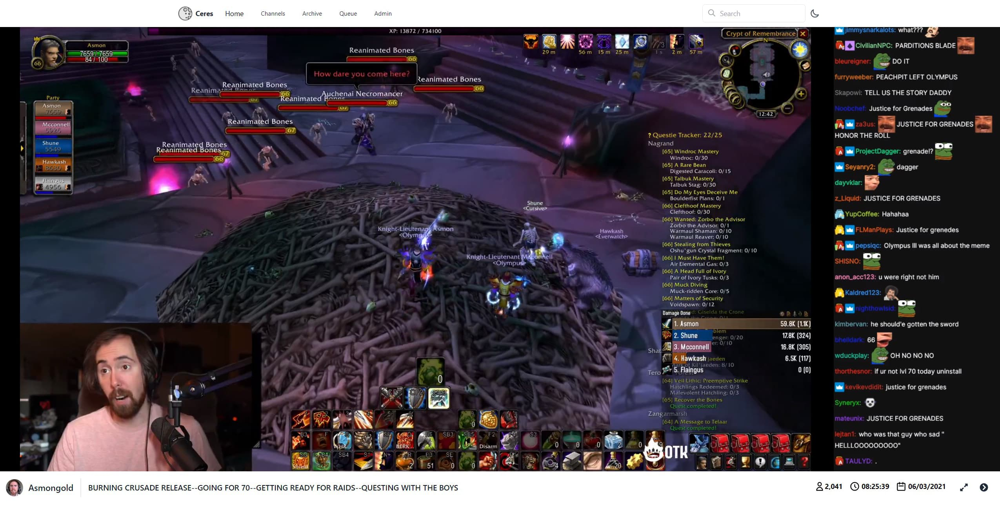

<!-- PROJECT LOGO -->
<br />
<div align="center">
  <a>
    
  </a>

  <h2 align="center">Ceres</h2>

  <p align="center">
    Archive Twitch VODs with a rendered chat.
  </p>
</div>

<!-- TABLE OF CONTENTS -->
<details>
  <summary>Table of Contents</summary>
  <ol>
    <li>
      <a href="#about">About The Project</a>
    </li>
    <li>
      <a href="#getting-started">Getting Started</a>
      <ul>
        <li><a href="#prerequisites">Prerequisites</a></li>
        <li><a href="#installation">Installation</a></li>
         <li><a href="#logging-in">Logging In</a></li>
          <li><a href="#archiving-your-first-vod">Archiving</a></li>
           <li><a href="#monitoring-the-progress">Monitoring</a></li>
      </ul>
    </li>
    <li><a href="#troubleshooting">Troubleshooting</a></li>
    <li><a href="#faq">FAQ</a></li>
    <li><a href="#license">License</a></li>
    <li><a href="#acknowledgments">Acknowledgments</a></li>
    <li><a href="#contact">Contact</a></li>
  </ol>
</details>

<!-- ABOUT THE PROJECT -->

## About



https://user-images.githubusercontent.com/21207065/148457965-aaaf922e-8be6-4c02-b132-c3a07b058308.mp4

Ceres is a backend and frontend solution for downloading and viewing Twitch VODs. Ceres uses [Lay295's TwitchDownloader](https://github.com/lay295/TwitchDownloader) to download the video and render the chat. Ceres downloads and saves everything locally meaning the data is yours to keep and no Twitch API calls are made while watching the VOD.

Downloaded data is saved in a user friendly way allowing you to keep and browse your archived vods without needing Ceres. Below is the folder structure for channel and VOD data.

```
/mnt/vods/
├── asmongold/
│   ├── 1042411777/
│   │   ├── 1042411777_video.mp4
│   │   ├── 1042411777_chat.mp4
│   │   ├── 1042411777_chat.json
│   │   ├── 1042411777_info.json
│   │   ├── 1042411777_thumbnail.jpg
│   │   └── 1042411777_web_thumbnail.jpg
│   ├── 1043421343/
│   │   └── ...
│   ├── 1046683902/
│   │   └── ...
│   ├── asmongold_profile.png
│   └── asmongold_offline_banner.png
├── mizkif/
│   ├── mizkif_profile.png
│   └── mizkif_offline_banner.png
├── esfandtv/
│   ├── esfandtv_profile.png
│   └── esfandtv_offline_banner.png
└── staysafetv/
    ├── staysafetv_profile.png
    └── staysafetv_offline_banner.png
```

<!-- GETTING STARTED -->

## Getting Started

### Prerequisites

- Linux environment with Docker and Docker Compose installed.
- _Optional_ Network share mounted for VOD storage (ex /mnt/vods).
- 50gb+ free space for downloading VODs before moving them to final destination.
- Twitch application for the client id and secret.
  - Create an app [here](https://dev.twitch.tv/console/apps/create). Anything can be supplied for the name and callback url.

### Installation

Download a copy of the [`docker-compose.yml`](https://github.com/Zibbp/Ceres/raw/master/docker-compose.yml) and the [`nginx.conf`](https://github.com/Zibbp/Ceres/raw/master/nginx.conf) files.

1. Edit the environment variables and paths. Below are snippets of the env vars and paths from each service that **need** to be changed.

**Ceres**

```
# ENV
DB_PASSWORD=CHANGEME    # openssl rand -hex 24
JWT_SECRET=CHANGEME     # openssl rand -hex 24
CLIENT_ID=CHANGEME      # Twitch Client ID
CLIENT_SECRET=CHANGEME  # Twitch Client Secret
API_URL=CHANGEME        # Http URL to Ceres API (this service) - example http://10.10.10.1:3950 or https://api.ceres.domain.com

# Volumes
/path/to/your/vods:/mnt/vods  # Change the path to where you vods are stored such as a network share (E.g. /mnt/nas/media/vods:/mnt/vods)
```

**Ceres-Frontend**

```
# ENV
API_URL=CHANGEME        # Http URL to API service (same url used above)
CDN_URL=CHANGEME        # Http URL Nginx service (http://10.10.10.1:3952 or https://cdn.ceres.domain.com)
NODE_ENV=development    # If hosting locally (http://IP) use development. If using SSL on a domain set to production to use secure cookies
```

**Ceres-DB**

```
# ENV
POSTGRES_PASSWORD=CHANGEME  # Same password set in the ceres service
```

**Ceres-CDN**

```
# Volumes
/path/to/nginx.conf:/etc/nginx/nginx.conf:ro  # Full path to the nginx conf
/path/to/your/vods:/mnt/vods                  # Full path to your vod storage location, same as the path in the ceres service
```

2. Bring up the services `docker-compose up -d`.

### Logging In

Visit the frontend (default port is 3951) and log in with the default credentials.

```
Username: admin
Password: adminadmin
```

Once logged in please secure your account by doing one of the following.

- Changing the admin password
- Creating a new account and using the admin account to give your new account admin permissions then deleting the admin account from your account.

### Archiving Your First VOD

1. Find a Twitch VOD and copy the ID from the URL (should be a string of numbers like 1249966495).
2. Navigate to the "Archive" page and enter the VOD ID.
   - _Once the ID is entered, click out of the input field to preview the VOD title, thumbnail, duration, and date._
     
3. Click "Archive".

### Monitoring the Progress

After archiving a VOD you will be redirected to the "queue" page. Here you can view the log of the video download, chat download, and chat render.


## Troubleshooting

### Missing images on the frontend

This is likely because the CDN_URL environment variable for the frontend is wrong. It should point the the Nginx service.

### Frontend unable to connect to the API

Ensure the API_URL environment variable is correctly set in both the frontend and api service.

### What to do when an archive job fails?

If an archiving job fails it will need to be restarted from the beginning. At the moment restart steps have not been added so the queue item and vod entry needs to be deleted from the admin panel. Once both have been removed the the VOD can be submitted for archive again.

## FAQ

### Can I be notified when a VOD is archived?

Yes, under your profile a Discord webhook url can be added to send a webhook when a VOD you submitted is archived.

<!-- LICENSE -->

## License

Distributed under the GNU General Public License. See `LICENSE` for more information.

<!-- ACKNOWLEDGMENTS -->

## Acknowledgments

- [Lay295's TwitchDownloader](https://github.com/lay295/TwitchDownloader) <-- Awesome utility!

<!-- CONTACT -->

## Contact

Discord - `Zibbp#2560`

Email - `On Github Profile`
